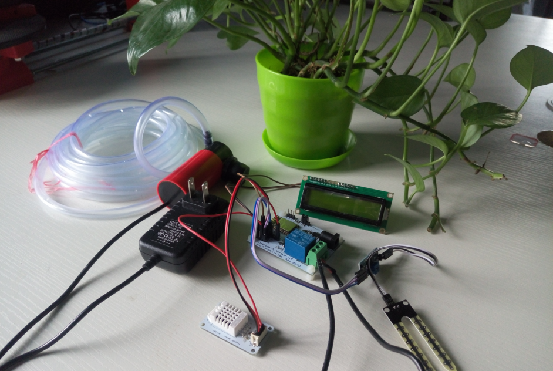
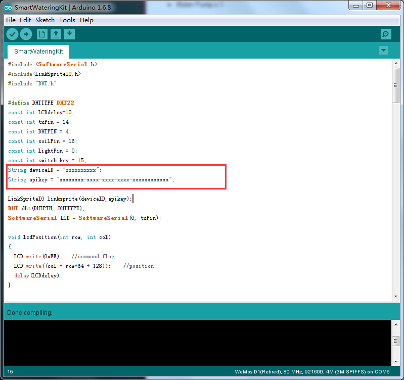
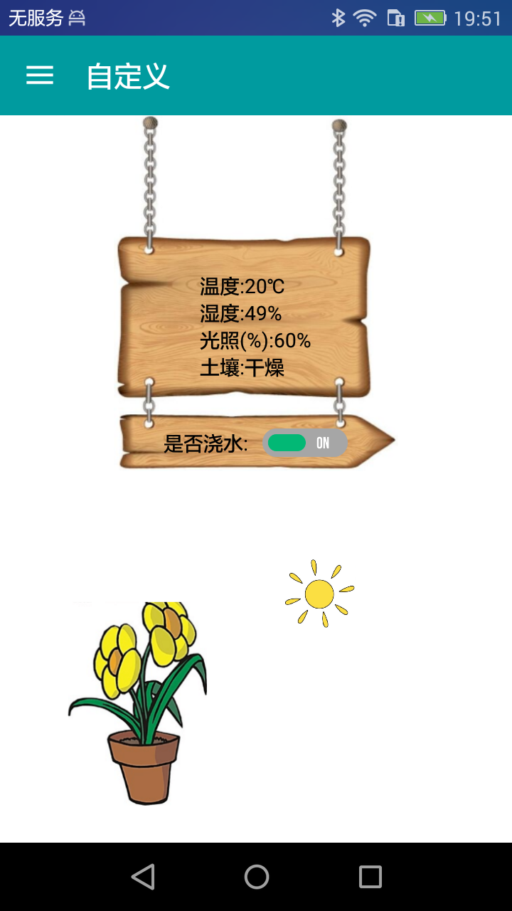

# Smart Watering Kit

In recent years, with the improvement of people's living standards, people on the home environment and air quality requirements are also increasing. People often through planting some green plants to improve the home environment and air quality, but also can ease their work pressure, relax mood. However, people often because of busy work and no time to take care of potted plants, wait to return to God, may have been on the verge of dying pot; or because of wrong planting methods, the lack of appropriate planting experience led to potted death. Thus, the market is in urgent need of a business trip in the user or when the owners lack of experience to help the user to take care of their own potted products. This is also the starting point of the project "Smart Watering Kit". Hope to help users simple, easy to take care of their own bonsai.

## Hardware Specifications

* LinkNode R1 by Esp8266 x 1
* SerLcd 1602 x 1
* Temp&RH Sensor x 1
* Light Sensor x 1
* Soil moisture sensor x 1
* Water Pump x 1

#### PinMap

| Sensors       | LinkNode R1   |
| ------------- | -------------:|
|  SerLcd 160   |               |
|  +5V          | 3V3           |
| GND           | GND           |
| RX            | G14           |
|Temp&RH Sensor |               |
|VCC            | 5V0           |
|GND            | GND           |
|SIG            | G4            |
|Ligth Sensor   |               |
|VCC            | 5V0           |
|GND            | GND           |
|Sig            | ADC           |
|Soil moisture sensor|          |
|D0             | G15           |
|VCC            | GND           |
|GND            | GND           |

## Tutorial

#### Get start with code

* Get Start with LinkNode R1 form [here](http://linksprite.com/wiki/index.php5?title=LinkNode_D1)
* Download the code of [Smart Water Kit](https://github.com/delongqilinksprite/SmartWatringKit.git)
* Get Start with [LinkSPriteIO](https://github.com/delongqilinksprite/LinkSpriteIO)
* Download the code of [LinkSpriteIO](https://github.com/delongqilinksprite/LinkSpriteIO)

Move the codes to Arduino-xxx/libraries/.and then restart the arduino ide,open the code replace the deviceID and apikey form you LinkSpriteIO device.

###### Note: Make sure you have a USB to TTL via,because we need use it download the code.

#### Get start with app
* Download [android app](https://github.com/delongqilinksprite/SmartWatringKit.git)
* Install the app with your android phone
* Sign in with your LinkSpriteIO

